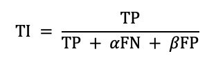
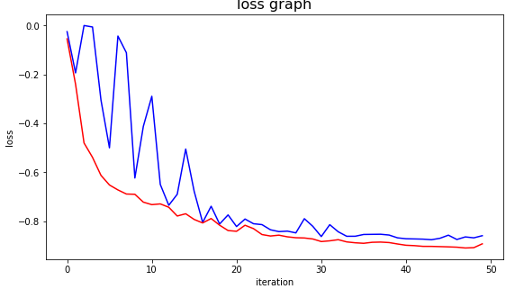
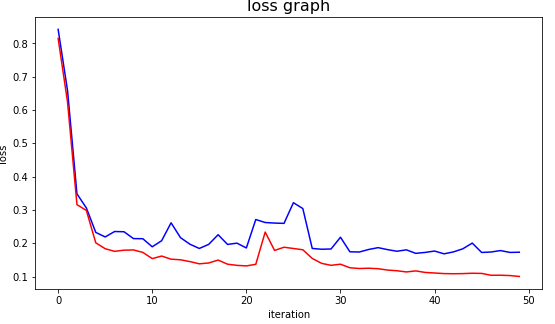
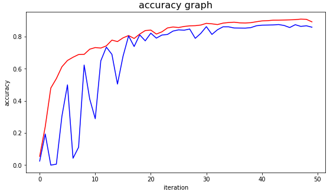
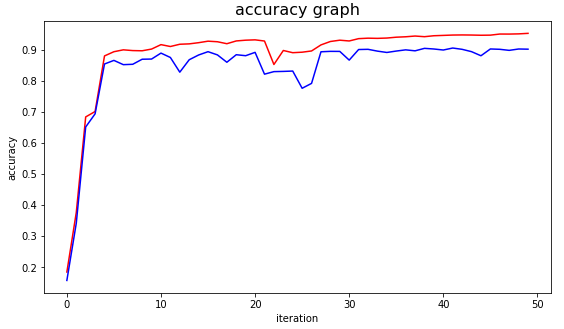

# Brain MRI Segmentation

The goal of brain tumour segmentation is to distinguish normal tissue from tumorous areas. To increase the chances of a successful treatment, this is an important stage in the diagnosis and treatment planning process. Magnetic resonance imaging (MRI) gives extensive information on brain tumour anatomy, making it a vital tool for accurate diagnosis. It is needed to replace the current manual detection technique, which relies on the skills and knowledge of a human. Using a U-Net-based deep learning model, a fully automatic system for segmenting malignant tumors in pre-operative MRI scans has been established. U-net architecture (example for 32x32 pixels in the lowest resolution). Each blue box corresponds to a multi-channel feature map. The results show that our approach successfully segments every contrast in the data, performing slightly better than classical Bayesian segmentation, and three orders of magnitude faster. Moreover, even within the same type of MRI contrast, our strategy generalizes significantly better across datasets, compared to training using real images.

This project does include PDF explaining everything about how we studied the literature and update the existing work.

# The major updates in this project are:

-   We have implemented a U-Net model for brain MRI segmentation.
-   We updated the loss function to make it more efficient.
-   We have used the Dice Coefficient as the evaluation metric.

# Use of tversky loss function

The Tversky loss function is a generalization of the Dice loss function. It is a weighted loss function that allows the user to specify the weight of false positives and false negatives. The Tversky loss function is defined as follows:

where α and β are the weights of false positives and false negatives, respectively. The Tversky loss function is a generalization of the Dice loss function, which is a special case of the Tversky loss function when α = β = 0.5.

# Impact of the Tversky loss function on the U-Net model

Dice Loss Graph | Tversky Loss Graph
--- | ---
 | 

The Tversky loss function is a generalization of the Dice loss function. It is a weighted loss function that allows the user to specify the weight of false positives and false negatives.

Dice Accuracy Graph | Tversky Accuracy Graph
--- | ---
 | 

# Links

[Kaggle Code](https://www.kaggle.com/code/parshwas/brain-mri-scan)
